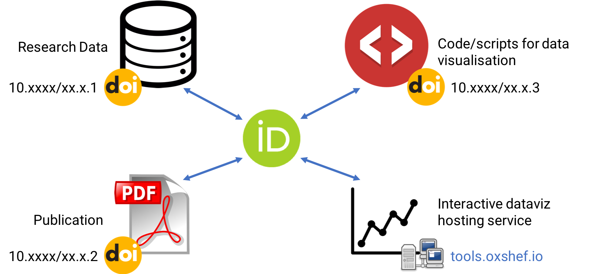

<!---
If we add the logos to the top section then these are the correct sizes!
<center>


</center>

!-->

# **OxShef: dataviz** promotes and supports the use of interactive data visualisations for communicating research datasets and outputs.

Our motivations are as follows:

<div class="row align-items-center">

    
<div class="col-sm-6 align-self-center">

- Interactive dataviz provide an exploratory tool to your audience, rather than fixed narratives provided by traditional communication tools

- Interactive dataviz can be designed to provide different experiences for expert and non-expert audiences

- Interactive dataviz help bridge the "data gap" as the underlying research data must be deposited in a DOI issuing repository.

**OxShef: dataviz** is a [partnership between multiple universities](http://partners.oxshef.io), currently the [University of Oxford](https://partners.oxshef.io/partners_university-of-oxford.html) and [University of Sheffield](https://partners.oxshef.io/partners_university-of-sheffield.html). Our resources are designed for all researchers who are interested in reproducible research and dataviz - irresepective of your home institution.

</div>
    
<div class="col-sm-6 align-self-center">

```{r, echo=FALSE}

```


</div>

</div>

<hr>

## OxShef: dataviz aims to answer four common questions
<p>

<div class="row align-items-center">
    
<div class="col-xs-6 align-self-center">

### **Which chart should I use?**

[charts.oxshef.io](http://charts.oxshef.io) provides advice on how to select the most appropriate charts for your data and how to avoid common mistakes in data visualisation. Subjects covered include:

- Charts (barcharts, piecharts, bubble charts)
- Maps (scattergeo, choropleth, meteorological charts)
- Time series (financial charts, time series)
- Networks

</div>
        
<div class="col-xs-6 align-self-center">

### **Which dataviz tool should I use?**

[tools.oxshef.io](http://tools.oxshef.io) provides an overview of the most popular tools used in both academia and industry for building interactive dataviz.

There are dedicated sites for dataviz tools that support a *reproducible data visualisation workflow*, currently this includes; [shiny.oxshef.io](http://shiny.oxshef.io).

</div>
</div>

<div class="row align-items-center">
  
<div class="col-xs-6 align-self-center">

### **Where can I deposit datasets?**

[repositories.oxshef.io](http://repositories.oxshef.io) provides an overview of the differences between file-sharing platforms like Dropbox, GoogleDrive, OneDrive and DOI-issuing data repositories.

Visit [repositories.oxshef.io](http://repositories.oxshef.io) for advice on the most appropriate data repository for your datasets and how to use them in a *reproducible data visualisation workflow*.

</div>

<div class="col-xs-6 align-self-center">

### **Do publishers care about dataviz?**

Academic publishers are seeking to differentiate themselves technologically, and it's clear that embedding dataviz alongside journal articles is an active area of interest.

For a list of publishers who support embedding dataviz please visit [publishers.oxshef.io](http://publishers.oxshef.io). This site also provides advice on best practices for linking to dataviz that are not hosted by the publisher.

</div>

</div>

<hr>

# OxShef promotes reproducible dataviz workflows

Reproducibility and replicability of research findings is incredibly important and very much in focus after high 

For research to be considered reproducible, researchers must document; all steps, methods and tools and technologies used. 
Here's a checklist to ensure a reprododucible dataviz workflow:

- All data shown in the dataviz is public and available via a DOI
- All code for the dataviz is public and available via a DOI
- All authors of the code and data are attributed by an ORCID

<p>

### **Cite research outputs with DOI**

<div class="row align-items-center">

<div class="col-sm-7 align-self-center">

Digital Object Identifiers (DOI) are the alphanumeric codes often seen in citations for academic papers, eg [DOI:10.1126/science.1102896](http://doi.org/10.1126/science.1102896). DOI are incredibly important (and useful) because they provide a permanent link to a resource (usually a PDF) which **should** never break.

DOI are issued by academic publishers and data repositories. Read more at [repositories.oxshef.io](http://repositories.oxshef.io).

</div>
    
<div class="col-sm-5 align-self-center">
<center>
```{r, echo=FALSE}
knitr::include_graphics("images/doi-vs-other-links.png")
```
</center>
</div>

</div>
<p>
### **Deposit data, code and publications separately**

<div class="row align-items-center">

<div class="col-sm-7 align-self-center">

Data (and code) are fundamental components of the majority of research in the sciences and increasingly often in the humanities too. However, they are often relegated to "supplementary materials". Publications, data and code should all be considered 1st rate research outputs.

Depositing data (and code) separately in DOI issuing repositories makes citing and discovering these resources easier, fostering citations and collaboration opportunities. Read more at [repositories.oxshef.io](http://repositories.oxshef.io).

</div>
    
<div class="col-sm-5 align-self-center">
<center>
```{r, echo=FALSE}

```
</center>
</div>

</div>
<p>
### **Uniquely identify researchers with ORCID**

<div class="row align-items-center">

<div class="col-sm-7 align-self-center">

Uniquely identifying authors by their names on publications is extremely difficult. There's a simple solution to this problem: [orcid.org](http://orcid.org). After registering for a **free** ORCID account you will be provided a unique id of the form: [0000-0002-3039-6849](https://orcid.org/0000-0002-3039-6849).

Your ORCID profile is an automatically populated publication record, provided that you remember to provide your ORCID number when publishing papers and depositing datasets online. It is also possible to claim previously published work via CrossRef and DataCite integrations.

</div>
    
<div class="col-sm-5 align-self-center">
<center>
```{r, echo=FALSE}

```
</center>
</div>

</div>

<hr>


<!-- ## Example charts -->

<!-- The visualisations below are examples of what you can build by following the tutorials and advice within the **OxShef: dataviz** websites. -->

<!-- <div class="row align-items-center"> -->

<!-- <div class="col-md-4 align-self-center"> -->

<!-- <center> -->

<!-- ```{r, echo=FALSE, message=FALSE, warning=FALSE, paged.print=FALSE} -->
<!-- library("tilegramsR") -->
<!-- library("leaflet") -->
<!-- library("sf") -->
<!-- library("statesRcontiguous") -->
<!-- library("tidyverse") -->

<!-- states_info <- shp_all_us_states -->
<!-- st_geometry(states_info) <- NULL -->


<!-- NPR1to1 <- st_as_sf(NPR1to1) %>% -->
<!--   left_join(states_info, by = c("state" = "state.short.name")) -->

<!-- palette_state_division <- colorFactor("Paired", unique(NPR1to1$state.division)) -->

<!-- leaflet( -->
<!--   NPR1to1, -->
<!--   options=leafletOptions( -->
<!--     crs = leafletCRS("L.CRS.Simple"), -->
<!--     minZoom = -3, maxZoom = -3, -->
<!--     dragging = FALSE, zoomControl = FALSE, -->
<!--     attributionControl = FALSE), -->
<!--   width = "350px", -->
<!--           height = "200px" -->
<!--   ) %>% -->
<!--   addPolygons( -->
<!--     weight=2, -->
<!--     color='#000000', group = 'states', -->
<!--     fillOpacity = 0.6, opacity = 1, fillColor= ~palette_state_division(state.division), -->
<!--     highlightOptions = highlightOptions(weight = 4), -->
<!--     label = ~paste0(state, " (", state.division, ")") -->
<!--     ) -->
<!-- ``` -->

<!-- <br> -->

<!-- ```{r, echo=FALSE, message=FALSE, warning=FALSE, paged.print=FALSE} -->
<!-- library("tidyverse") -->
<!-- library("leaflet") -->
<!-- library("sf") -->
<!-- library("gapminder") -->

<!-- geojson_worldmap <- st_read("https://raw.githubusercontent.com/johan/world.geo.json/master/countries.geo.json", -->
<!--                             quiet = TRUE) -->
<!-- geojson_worldmap <- invisible(geojson_worldmap %>% -->
<!--   left_join(gapminder %>% -->
<!--                filter(year == max(year)) , by = c("name" = "country")) %>% -->
<!--   filter(name != "Antarctica")) -->
<!-- palette_pop <- colorNumeric("YlOrBr" , geojson_worldmap$pop, na.color = "#c0c1c4") -->
<!-- geojson_worldmap %>% -->
<!--   leaflet(width = "350px", -->
<!--           height = "200px") %>% -->
<!--   addPolygons(fillColor = ~palette_pop(pop), -->
<!--               fillOpacity = 0.8, -->
<!--               color = "#000", -->
<!--               weight = 1, -->
<!--               label = ~name) -->
<!-- ``` -->

<!-- <br> -->

<!-- ```{r, echo=FALSE, message=FALSE, warning=FALSE, paged.print=FALSE} -->
<!-- quakes %>% -->
<!--   leaflet( width = "350px", -->
<!--           height = "200px") %>% -->
<!--   addProviderTiles(providers$Esri.OceanBasemap) %>% -->
<!--   addCircleMarkers(clusterOptions = markerClusterOptions()) -->
<!-- ``` -->

<!-- </center> -->

<!-- </div> -->

<!-- <div class="col-md-4 align-self-center"> -->
<!-- <center> -->

<!-- ```{r, echo=FALSE, message=FALSE, warning=FALSE, paged.print=FALSE} -->
<!-- library("gapminder") -->
<!-- library("highcharter") -->
<!-- gapminder %>% -->
<!--   group_by(continent, year) %>% -->
<!--   summarise(median.life.exp = median(lifeExp)) %>% -->
<!--   hchart(type = "scatter", -->
<!--          hcaes(x = year, y = median.life.exp, group = continent)) %>% -->
<!--   hc_size(width = "350px", height = "200px") %>% -->
<!--   hc_subtitle(text = "Median life expectancy per continent (Source: Gapminder)") %>% -->
<!--   hc_yAxis(title = list(text = "Life expectancy")) -->
<!-- ``` -->

<!-- <br> -->

<!-- ```{r, echo=FALSE, message=FALSE, warning=FALSE, paged.print=FALSE} -->
<!-- library("highcharter") -->
<!-- library("tidyverse") -->
<!-- my_data <- tribble( -->
<!--   ~category, ~value, -->
<!--   "human", 3, -->
<!--   "non-human", 4, -->
<!--   "snake", 6, -->
<!--   "iguana", 8 -->
<!-- ) -->
<!-- my_data %>% -->
<!--   hchart( -->
<!--     type = "pie", -->
<!--     hcaes( -->
<!--       x = category, -->
<!--       y = value -->
<!--     ) -->
<!--   ) %>% -->
<!--   hc_plotOptions(pie = list(dataLabels = list(enabled = FALSE))) %>% -->
<!--   hc_size(width = "350px", height = "200px") -->
<!-- ``` -->

<!-- <br> -->

<!-- ```{r, echo=FALSE, message=FALSE, warning=FALSE, paged.print=FALSE} -->
<!-- library("highcharter") -->
<!-- library("tidyverse") -->
<!-- my_data <- tribble( -->
<!--   ~category, ~subcategory, ~value, -->
<!--   "Mammal", "human", 3, -->
<!--   "Mammal", "non-human", 4, -->
<!--   "Reptile", "snake", 6, -->
<!--   "Reptile", "iguana", 8 -->
<!-- ) -->
<!-- my_data %>% -->
<!--   hchart( -->
<!--     type = "bar", -->
<!--     hcaes( -->
<!--       x = category, -->
<!--       y = value, -->
<!--       group = subcategory -->
<!--     ) -->
<!--   ) %>% -->
<!--   hc_size(width = "350px", height = "200px") %>% -->
<!--   hc_plotOptions(series = list(stacking = "percent")) %>% -->
<!--   hc_title(text = "Stacked percentage barchart", -->
<!--            style = list(fontSize = 12)) -->
<!-- ``` -->

<!-- </center> -->

<!-- </div> -->

<!-- <div class="col-md-4 align-self-center"> -->

<!-- <center> -->

<!-- ```{r, echo=FALSE, message=FALSE, warning=FALSE, paged.print=FALSE} -->
<!-- library("tidyverse") -->
<!-- library("visNetwork") -->
<!-- library("igraph") -->

<!-- my_nodes <- tribble( -->
<!--   ~id, ~label, ~color, ~size, -->
<!--   1, "Character A", "purple", 10, -->
<!--   2, "Character B", "purple", 13, -->
<!--   3, "Character C", "orange", 17, -->
<!--   4, "Character D", "orange", 12, -->
<!--   5, "Character E", "purple", 17, -->
<!--   6, "Character Z", "green", 10 -->
<!-- ) -->

<!-- my_edges <- tribble( -->
<!--   ~from, ~to, ~width, -->
<!--   1, 2, 5, -->
<!--   # 2, 1, 5, -->
<!--   3, 1, 1, -->
<!--   # 1, 3, 1, -->
<!--   4, 1, 6, -->
<!--   # 1, 4, 6, -->
<!--   4, 2, 3, -->
<!--   # 2, 4, 3, -->
<!--   5, 2, 2, -->
<!--   # 2, 5, 2, -->
<!--   5, 3, 5, -->
<!--   # 3, 5, 5, -->
<!--   5, 6, 5 -->
<!--   # 6, 5, 5 -->
<!-- ) -->

<!-- visNetwork(my_nodes, -->
<!--            my_edges, -->
<!--            width = "350px", -->
<!--            height = "200px") %>% -->
<!--   visOptions(highlightNearest = list(enabled = TRUE, degree = 1)) %>% -->
<!--   visInteraction(zoomView = FALSE) -->
<!-- ``` -->

<!-- <br> -->

<!-- ```{r echo=FALSE, message=FALSE, warning=FALSE, paged.print=FALSE} -->
<!-- mpgman3 <- mpg %>% -->
<!--   group_by(manufacturer) %>% -->
<!--   summarise(n = n(), unique = length(unique(model))) %>% -->
<!--   arrange(-n, -unique) -->
<!-- ## Observations: 15 -->
<!-- ## Variables: 3 -->
<!-- ## $ manufacturer <chr> "dodge", "toyota", "volkswagen", "ford", "chevrol... -->
<!-- ## $ n            <int> 37, 34, 27, 25, 19, 18, 14, 14, 13, 9, 8, 5, 4, 4, 3 -->
<!-- ## $ unique       <int> 4, 6, 4, 4, 4, 3, 2, 2, 3, 1, 1, 1, 1, 1, 1 -->

<!-- hchart(mpgman3, "treemap", hcaes(x = manufacturer, value = n, color = unique)) %>% -->
<!--   hc_size(width = "350px", height = "200px") %>% -->
<!--   hc_legend(enabled = FALSE) -->
<!-- ``` -->

<!-- <br> -->

<!-- ```{r, echo=FALSE, message=FALSE, warning=FALSE, paged.print=FALSE} -->
<!-- library("quantmod") -->

<!-- usdjpy <- getSymbols("USD/JPY", src = "oanda", auto.assign = FALSE) -->
<!-- eurjpy <- getSymbols("EUR/JPY", src = "oanda", auto.assign = FALSE) -->

<!-- highchart(type = "stock") %>% -->
<!--   hc_add_series(usdjpy, id = "usdjpy") %>% -->
<!--   hc_add_series(eurjpy, id = "eurjpy") %>% -->
<!--   hc_size(width = "350px", height = "200px") %>% -->
<!--   hc_rangeSelector(enabled = FALSE) -->
<!-- ``` -->

<!-- </center> -->

<!-- </div> -->

<!-- </div> -->


<!-- </center> -->

